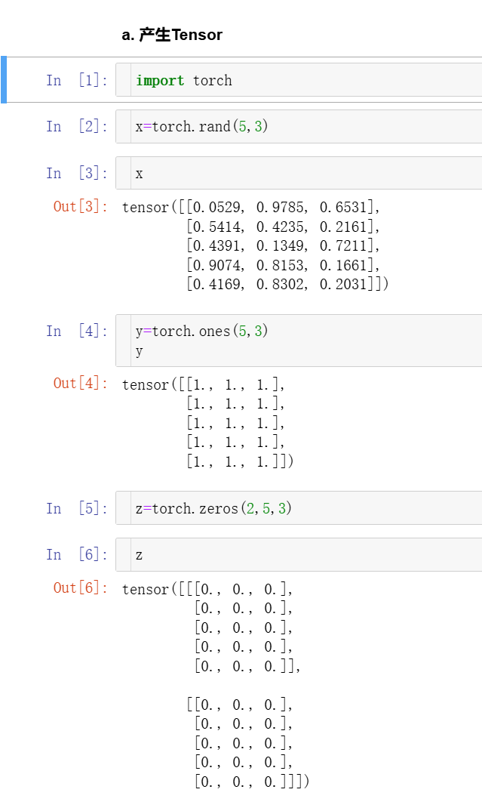
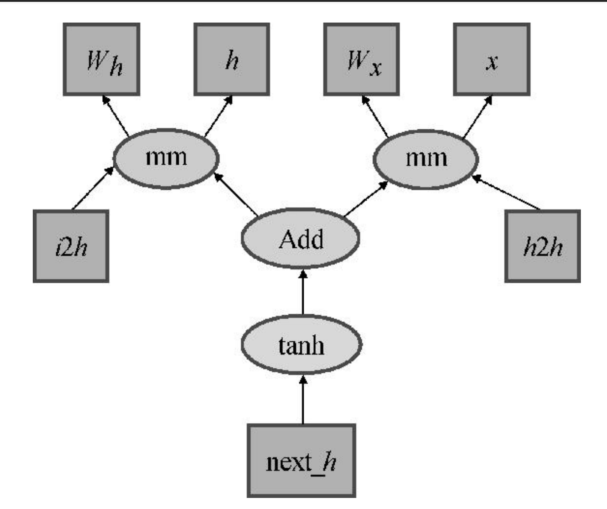

# 深度学习实战笔记

## 第一章 深度学习简要介绍

**深度学习影响因素**

1. 大数据，数据量的大小决定深度神经网络分类和预测准确度
2. 网络架构，前馈、卷积、循环的组合架构
3. 训练方式
4. GPU 大规模张量计算

**深度学习成功的原因**

1. 特征学习，自动提取特征信息
2. 迁移学习，把训练好的神经网络迁移到另一个神经网络中去

## 第二章 PyTorch简介

**PyTorch三个关键特性**

1. 与Python完美融合
2. 支持张量计算
3. 动态计算图

**张量计算**




三维张量 (a,b,c) a是矩阵个数，b是行，c是列

张量访问 x[1,2]，二维张量第二行第三列，x[:,2] 第三列所有元素

**张量与NumPy数组之间的转换**

a.numpy()

torch.from_numpy(b)

torch.FloatTensor(b) float类型

torch.LongTensor(b) int类型


**GPU上的张量运输**

torch.cuda.is_available()

x=x.cuda()   把tensor放在gpu上

y=y.cuda()    

x=x.cpu()     把tensor放在cpu上


**动态计算图**

深度学习的核心是利用反向传播算法，精确计算网络每一个单元对网络的贡献，现在大多数深度学习框架采用了计算图技术，不需要为每一种架构的网络定制不同的反向传播算法，只需要关注如何实现神经网络的前馈运输即可。前馈运输完成后，深度学习框架会自动搭建计算图，让反向传播算法自动运行。计算图技术的出现大幅度提升了构建神经技术系统的效率。

*计算图的构成*

1. 变量variable
2. 运算computation
3. 有向连边 表示节点的因果和依赖关系

如图所示



箭头方向表示输入来源，方框节点为变量，椭圆节点为运输操作

PyTorch借助自动微分变量实现动态计算图的，自动微分变量和普通的张量表面没区别，但内部数据结构比张量复杂，目前这两个变成了一个，每一个张量都是一个自动微分变量。

自动微分变量有三部分组成，data、grad、grad_fn

data是普通张量，grad_fn是存储计算路径，用于访问计算图上一个节点，调用.backward()后，导数值存储在 .grad中

示例：

```python
#Python

x=torch.ones(2,2,requires_grad=True)

y=x+2

z=y*y

t=torch.mean(z)

t.backward()

z.grad; y.grad; x.grad

```

PyTorch规定，只有计算图的叶节点才可以通过.backward()获得梯度信息

------

```python
a=torch.rand(1,requires_grad=True)
predictions=a.expand_as(x_train)*x_train
expand_as(x)# 可以升维

a = torch.rand(1, requires_grad = True)
b = torch.rand(1, requires_grad = True)
predictions = a.expand_as(x_train) * x_train + b.expand_as(x_train)
predictions

loss = torch.mean((predictions - y_train) ** 2)  #计算损失函数
loss.backward() #开始反向传播梯度

#开始梯度下降，其中0.001为学习率
a.data.add_(- 0.001 * a.grad.data) 
b.data.add_(- 0.001 * b.grad.data)

#注意我们无法改变一个tensor，而只能对tensor的data属性做更改
#所有函数加“_”都意味着需要更新调用者的数值

a.grad.data.zero_()
b.grad.data.zero_()


```

## 第三章单车预测器

1. **通用逼近定理**

用有限多的隐含神经元可以逼近任意的有限区间内的曲线

2. **归一化的问题**

为什么要对输入进行归一化，不对训练的输出数据归一化

3. 对输入归一化：

在机器学习中，对输入数据进行归一化（Normalization）是一种常见的数据预处理方法。它的主要目的是将不同特征的数值范围缩放到一个相似的尺度，从而避免某些特征在训练过程中对模型的影响过大或过小。具体来说，归一化有以下几个主要原因：

 1. **提高模型的收敛速度**

- **梯度下降算法**：大多数机器学习模型，如线性回归、逻辑回归、神经网络等，依赖于梯度下降优化算法来调整模型参数。如果特征的数值范围差异过大，某些参数的梯度会过大，导致更新幅度不均衡，从而使得模型训练不稳定，收敛速度较慢。
- 归一化将特征值缩放到相似的范围，使得各个特征在梯度下降过程中的学习步伐更加均匀，有助于加速收敛。

 2. **避免特征的尺度差异对模型的影响**

- 对于许多机器学习算法（如支持向量机、k-近邻等），模型的性能与特征的尺度密切相关。如果某些特征的数值范围较大，而其他特征的数值范围较小，那么具有较大数值范围的特征可能会主导模型的训练过程，导致模型过度关注这些特征，忽视其他特征。
- 归一化通过将所有特征压缩到一个相对统一的尺度，使得所有特征在模型训练过程中同等重要，从而提高模型的准确性和表现。

 3. **提高距离度量的准确性**

- 许多机器学习算法（例如K-近邻、聚类算法等）基于样本之间的距离度量进行计算，如欧氏距离。如果特征的量纲不同，某个特征的值较大将会主导距离的计算，导致距离度量偏向这个特征。
- 归一化使得所有特征在相同尺度下有同等的贡献，从而使得距离度量更加准确。

 4. **适应正则化**

- 正则化（例如L2正则化）是机器学习中的一种常用方法，目的是防止模型过拟合。正则化的作用是对模型的参数加上惩罚项，而这个惩罚项通常是基于参数的大小来计算的。如果输入数据没有经过归一化处理，某些特征的值会比其他特征大得多，可能导致正则化效果不均衡。
- 归一化可以确保正则化对所有特征的影响是均等的，有助于更好的控制模型复杂度。

5. **改善模型的稳定性**

- 归一化有助于避免数值计算中的不稳定性，特别是在某些需要计算矩阵逆、特征值分解等操作的算法中（例如PCA、线性回归等）。
- 特征值范围差异较大的情况下，计算过程可能会出现数值溢出或精度丢失，影响模型训练结果。

为什么不对输出归一化？

1. **输出的尺度决定了模型的目标**

- **输出代表了模型的预测目标**，它通常与实际问题的物理含义或业务需求紧密相关。例如，在回归问题中，输出可能代表的是房价、温度、股市价格等真实数值，这些数值的尺度是有意义的。
- 如果对输出进行归一化，就会改变模型的目标尺度，导致结果不再具有直观的实际意义。例如，归一化后的输出可能会被压缩到0到1的范围内，而原始的数值范围可能是几千到几万。这会使得解读和应用模型结果变得更加困难。

2. **输出不一定符合归一化的假设**

- **输出分布不同于输入**。输入特征通常有多个维度，而且它们的数值可能差异较大（如不同的单位或尺度），因此需要进行归一化以消除尺度差异。而输出一般只有一个维度，且通常是需要直接预测的目标。
- 例如，在分类问题中，输出标签通常是类别标签，不存在尺度问题，因此不需要归一化。而在回归问题中，输出的数值范围通常是已知的，并且与实际场景直接相关，归一化反而可能让结果丧失实际意义。

3. **归一化输出可能导致模型复杂度增加**

- 如果对输出进行归一化，训练过程中需要对归一化后的输出进行反归一化。也就是说，模型在训练时使用的是归一化后的目标，预测时输出的结果也会是归一化的值，这就需要额外的反向变换步骤。
- 这增加了计算的复杂度，并可能在实际应用中引入误差。此外，反归一化的过程也可能受到数据不一致的影响，特别是在测试集的分布与训练集不完全一致时，可能导致误差较大。

4. **模型输出通常已经具备适当的尺度**

- 在许多问题中，输出本身已经有合适的范围。例如，在图像处理中，输出的像素值通常在0到255之间；在回归问题中，输出的数值范围通常是基于实际数据的。如果对输出进行归一化，可能会使得模型的训练过程变得不必要地复杂，甚至导致结果的误解。

5. **对于回归问题，归一化可能会改变损失函数的性质**

- 对回归问题中的输出进行归一化可能影响损失函数的表现，尤其是均方误差（MSE）损失。归一化后的数据可能改变损失的尺度，使得模型的训练和调参变得更加困难，特别是在超参数调整时。

### 1.**机器学习的基本流程**

1.数据预处理

- 对基础数据进行加工和清洗（耗费时间）
- 进行归一化操作
- 数据集分割
- 划定网络架构

```python
# 人工手动架构
def neu(x):
    #计算隐含层输出
    #x为batch_size * input_size的矩阵，weights1为input_size*hidden_size矩阵，
    #biases为hidden_size向量，输出为batch_size * hidden_size矩阵    
    hidden = x.mm(weights1) + biases1.expand(x.size()[0], hidden_size)
    hidden = torch.sigmoid(hidden)
    
    #输入batch_size * hidden_size矩阵，mm上weights2, hidden_size*output_size矩阵，
    #输出batch_size*output_size矩阵
    output = hidden.mm(weights2)
    return output
def cost(x, y):
    # 计算损失函数
    error = torch.mean((x - y)**2)
    return error
def zero_grad():
    # 清空每个参数的梯度信息
    if weights1.grad is not None and biases1.grad is not None and weights2.grad is not None:
        weights1.grad.data.zero_()
        weights2.grad.data.zero_()
        biases1.grad.data.zero_()
def optimizer_step(learning_rate):
    # 梯度下降算法
    weights1.data.add_(- learning_rate * weights1.grad.data)
    weights2.data.add_(- learning_rate * weights2.grad.data)
    biases1.data.add_(- learning_rate * biases1.grad.data)
    
losses = []
for i in range(1000):
    # 每128个样本点被划分为一个撮，在循环的时候一批一批地读取
    batch_loss = []
    # start和end分别是提取一个batch数据的起始和终止下标
    for start in range(0, len(X), batch_size):
        end = start + batch_size if start + batch_size < len(X) else len(X)
        xx = torch.tensor(X[start:end], dtype = torch.float64, requires_grad = True)
        yy = torch.tensor(Y[start:end], dtype = torch.float64, requires_grad = True)
        predict = neu(xx)
        loss = cost(predict, yy)
        zero_grad()
        loss.backward()
        optimizer_step(0.01)
        batch_loss.append(loss.data.numpy())
    
    # 每隔100步输出一下损失值（loss）
    if i % 100==0:
        losses.append(np.mean(batch_loss))
        print(i, np.mean(batch_loss))
```


```python
# 调用PyTorch包
# 定义神经网络架构，features.shape[1]个输入层单元，10个隐含层，1个输出层
input_size = features.shape[1]
hidden_size = 10
output_size = 1
batch_size = 128
neu = torch.nn.Sequential(
    torch.nn.Linear(input_size, hidden_size),
    torch.nn.Sigmoid(),
    torch.nn.Linear(hidden_size, output_size),
)
cost = torch.nn.MSELoss()
optimizer = torch.optim.SGD(neu.parameters(), lr = 0.01)

losses = []
for i in range(1000):
    # 每128个样本点被划分为一个撮，在循环的时候一批一批地读取
    batch_loss = []
    # start和end分别是提取一个batch数据的起始和终止下标
    for start in range(0, len(X), batch_size):
        end = start + batch_size if start + batch_size < len(X) else len(X)
        xx = torch.tensor(X[start:end], dtype = torch.float, requires_grad = True)
        yy = torch.tensor(Y[start:end], dtype = torch.float, requires_grad = True)
        predict = neu(xx)
        loss = cost(predict, yy)
        optimizer.zero_grad()
        loss.backward()
        optimizer.step()
        batch_loss.append(loss.data.numpy())
    
    # 每隔100步输出一下损失值（loss）
    if i % 100==0:
        losses.append(np.mean(batch_loss))
        print(i, np.mean(batch_loss))
```

